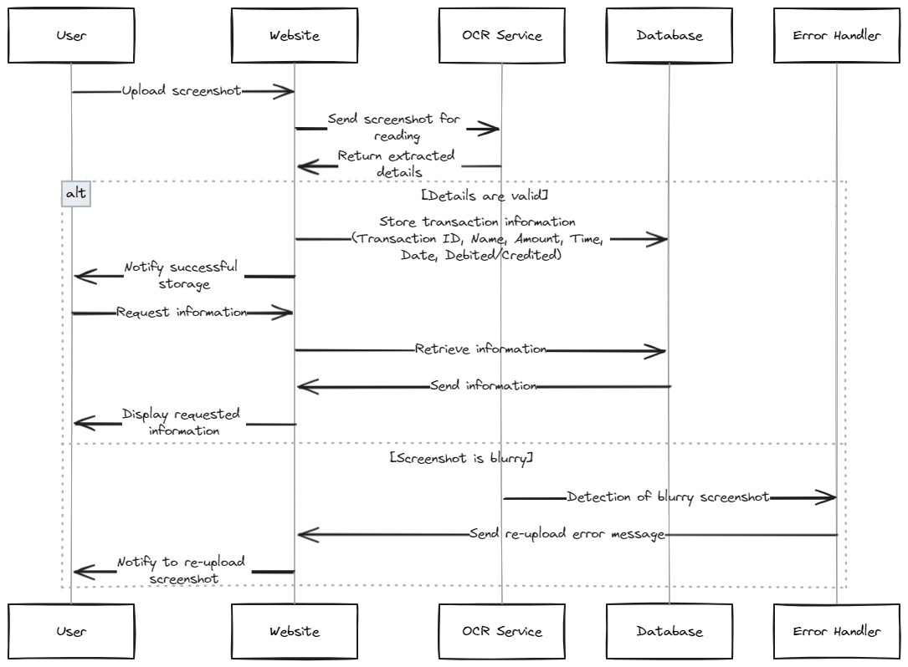

# OCR-Transact

OCR-Transact is a web application designed to transform screenshots into transactions. The application leverages OCR (Optical Character Recognition) technology via the Gemini API to extract transaction data from images and present it in a user-friendly table and chart format.



## Features

- **Screenshot Upload**: Easily upload screenshots of transactions.
- **OCR Processing**: Extract text and transaction details from uploaded images using the Gemini API.
- **Transaction Management**: View and manage transactions in a table format.
- **Chart Visualization**: Visualize transaction data in charts.
- **Responsive Design**: Optimized for both desktop and mobile devices.

## Technologies Used

- **Frontend**:
  - HTML5
  - CSS3
  - JavaScript
  - Bootstrap 5

- **Backend**:
  - Node.js
  - Gemini API

- **Other Tools**:
  - AWS (for hosting and storage)
  - Vercel (for frontend deployment)

## Setup Instructions

1. **Clone the repository**:
    ```sh
    git clone https://github.com/PATILYASHH/OCR-Transact.git
    cd OCR-Transact
    ```

2. **Install Dependencies**:
    ```sh
    npm install
    ```

3. **Run the Application**:
    ```sh
    npm start
    ```

4. **Access the Frontend**:
    Visit [OCR-Transact](https://ocrtransact.vercel.app/) to see the application in action.

5. **Set API Key**:
    Enter your Gemini API key on the website to enable OCR processing.

## Example Transaction Table

| Transaction ID | Name         | Amount | Debited/Credited | Date       | Time    |
|----------------|--------------|--------|------------------|------------|---------|
| 1              | John Doe     | $100   | Credited         | 2024-07-15 | 12:34PM |
| 2              | Jane Smith   | $50    | Debited          | 2024-07-14 | 03:45PM |
| 3              | Bob Johnson  | $200   | Credited         | 2024-07-13 | 09:20AM |

## Remaining Work

- **Backend Development**: Complete the integration with the Gemini API and handle image processing, transaction data extraction, and storage.
- **Frontend Design Improvement**: Enhance the user interface for a better user experience.
- **Responsiveness**: Ensure the application is fully responsive across all devices and screen sizes.

## Contributing

We welcome contributions from the community! If you're interested in contributing to the backend of this project, please follow these steps:

1. Fork the repository.
2. Create a new branch (`git checkout -b feature/YourFeature`).
3. Commit your changes (`git commit -m 'Add some feature'`).
4. Push to the branch (`git push origin feature/YourFeature`).
5. Open a pull request.

Please ensure your code adheres to our coding standards and includes tests where applicable.

## License

This project is licensed under the MIT License - see the [LICENSE](https://github.com/PATILYASHH/LICENES) file for details.
